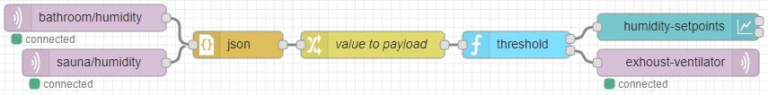

# self-adjusting-threshold
[![NPM version][npm-image]][npm-url]

[npm-image]: http://img.shields.io/npm/v/node-red-contrib-self-adjusting-threshold.svg
[npm-url]: https://npmjs.org/package/node-red-contrib-self-adjusting-threshold

[Node-RED](https://nodered.org/) contrib node for (home) automation. Humidity level controller for multiple zones with single exhoust ventilator

## What
Self adjusting threshold controller for single exhaust ventilator to react in rapid change of humidity in wet rooms. Multiple zones supported.

## Why
As overall environment conditions change seasonally and change of outside weather affects indoor conditions, the setpoint of exhoust ventilator may needs to be corrected. This correction mechanism is automated with this node. 

## How
Self adjusting calculation bases on relatively long term storage of input values.
Node works only for input values in between 0 ... 100  
If used for **multiple zones**, the **msg.topic** per zone is mandatory. 
Expected input is humidity level of one or more zones with rate about once in minute.
On every input the state is calculated and if new state is found at the other side of the threshold the output is fired. 
Node has single point threshold value (per zone). There is no hysteresis to set or to expect. Oscillation is avoided by timed control of output. 
The output of node is the state of ventilator in boolean manner. Output type is configurable. ON/OFF, true/false or 1/0 (output can be reversed)

## Example flow

## Good to know
This node uses context storage. If you are using file based presistable context option of Node-RED, the sate data will survie the restarts of system and there will be no unexpected behaviors. 

This node is targeted to control humidity change. This is **slowly changing proccess**. Do not expect correct behavior if system has been running less than 12 hours (if default settings applied)

